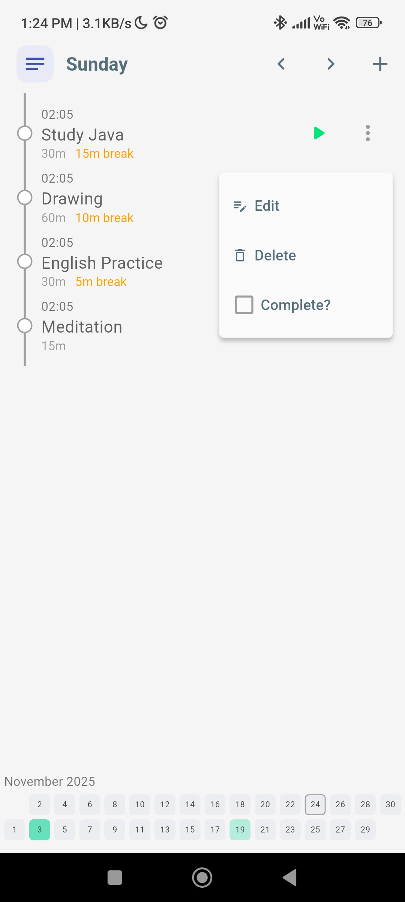
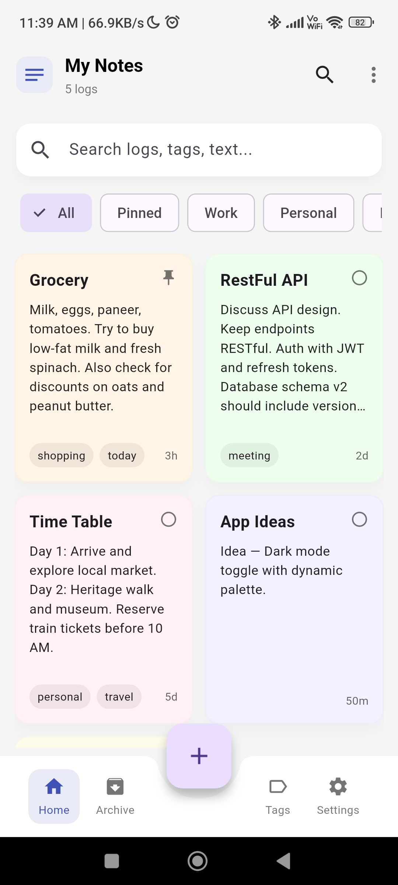
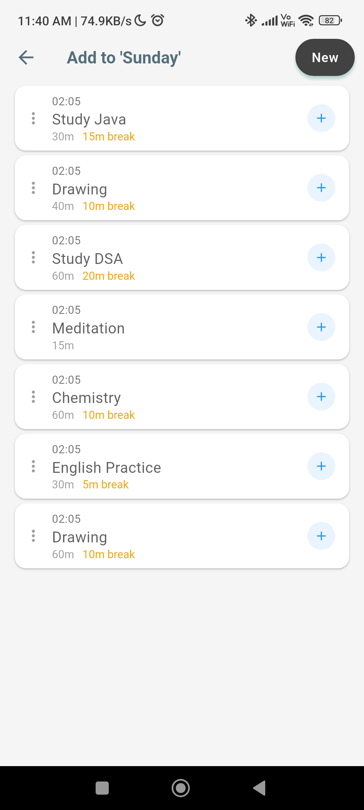
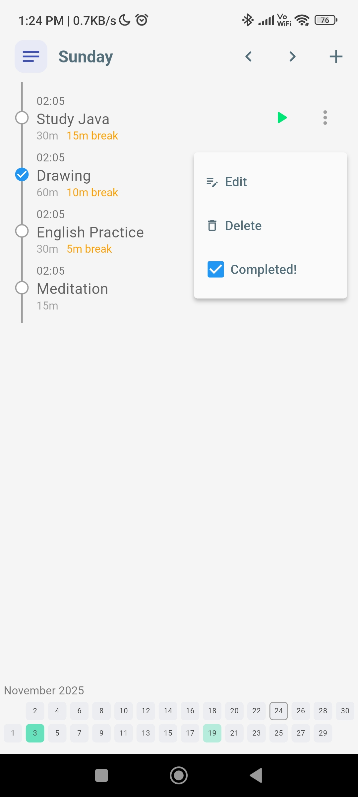
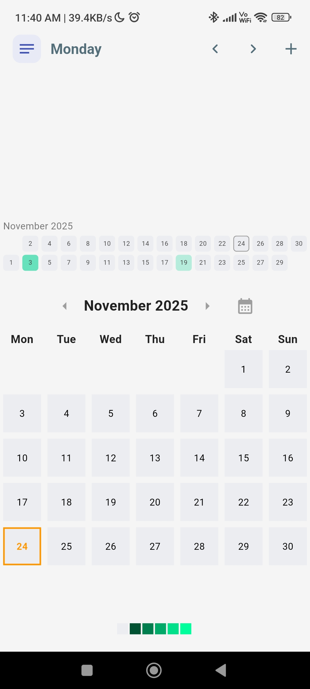
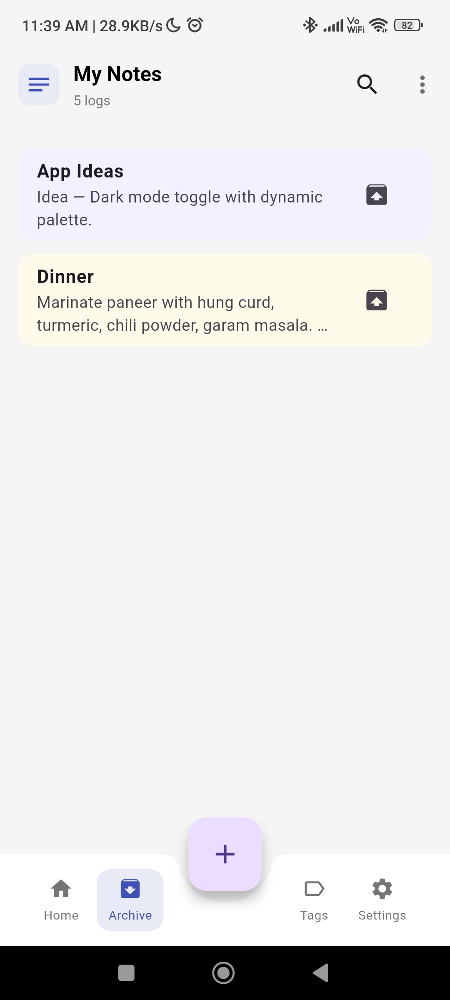

# DisciplinePlus

DisciplinePlus is a lightweight, offline-first productivity app I built to help users form habits, plan initiatives, and maintain a daily log.  
*A productivity app designed to help you build strong habits and master self-discipline. Set daily goals, track progress, and stay motivated with reminders and visual heatmaps.*

---

## 📸 Screenshots

### 📱 App Overview
<div style="text-align: center">
  
  
  
  
</div>

### 🎯 Initiative Manager
<div style="text-align: center">
  
  
  
  
</div>

### 📝 Daily Log & Notes
<div style="text-align: center">
  
  
  
  
</div>

### 🔥 Habit Tracker
<div style="text-align: center">
  
</div>

---

## 🧩 Modules

### 1. Initiative Manager
Helps you create structured study/work initiatives and schedule them across the week.  
Features include reordering, timers, completion tracking, and history logs.

### 2. Habit Tracker
A simple daily habit system with marking, streaks, monthly heatmaps, and analytics.

### 3. Daily Log / Notes
A quick logging system for daily reflections. Logs can be linked to initiatives and sorted.  
Password protection is optional based on user settings.

---

## ⭐ Key Features

- Offline-first architecture using **Drift** as the local authoritative database
- Background synchronization with **Firebase Firestore**
- Cross-platform support (Android + Web; iOS possible)
- Clean UI with heatmaps and progress visuals
- JSON export / backup support
- Riverpod-based state management
- Drift migrations to ensure stable versioned data updates

---

## 🛠 Tech Stack

- **Flutter & Dart**
- **Drift (SQLite)** for local DB
- **Firebase Authentication + Firestore**
- **Riverpod** for state management
- **Flutter Test & Firebase Emulator** for testing workflow

---

## 🚀 Getting Started (Developer Setup)

### 1. Clone Repository
```bash
git clone https://github.com/AshwaniDev101/Flutter-DisciplinePlus.git
cd Flutter-DisciplinePlus
```

MIT License  
© 2025 Ashwani yadav
